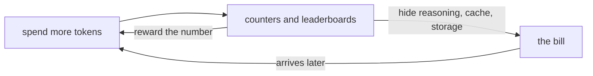

# Token Maxxing

> **The other direction.** A token has three clocks; tokenmaxxing is what
> happens when nobody reads the meter. This is the blow-ups cataloged, the root
> causes named, the ledgers totaled, and the honest boundary drawn — the
> negative results, kept on purpose, because the pattern is easier to recognize
> on someone else's bill than on your own.

Part of [Awesome Token Minimalism](README.md).

> *Last verified 2026-10. Prices, model names, and context limits move weekly; re-derive the numbers, not just the links.*

---

## Contents

- [The scoreboard](#the-scoreboard)
- [What it is](#what-it-is)
- [Ten root causes](#ten-root-causes)
- [The seven harm ledgers](#the-seven-harm-ledgers)
- [The cases](#the-cases) — sixteen failure modes
- [Why it persists](#why-it-persists)
- [What is not tokenmaxxing](#what-is-not-tokenmaxxing)
- [The counter-discipline](#the-counter-discipline)
- [See also](#see-also)

---

## The scoreboard

The worst measured numbers in this catalog, in one place. Every figure is
graded and linked below.

| Case | The number | Source |
|---|---|---|
| One MCP tool, average output | **557,766 tokens** | [MSR](https://www.microsoft.com/en-us/research/blog/tool-space-interference-in-the-mcp-era-designing-for-agent-compatibility-at-scale) |
| GraphRAG-global, per query | **331,375 tokens** vs vector RAG's **879** | [arXiv 2506.05690](https://arxiv.org/html/2506.05690v3) |
| A $0.033 call with thinking on | **+$0.205 (7.2×)** | [Nadir](https://getnadir.com/blog/extended-thinking-tokens-output-billing) |
| Screenshot vs ARIA snapshot | **15,704 vs 121 tokens (129.8×)** | [caveman](https://github.com/JuliusBrussee/caveman) |
| Thinking tokens on GPQA (Gemini 3 Flash) | **208M tokens** | [dev.to](https://dev.to/max_quimby/the-hidden-cost-of-cheap-ai-why-budget-reasoning-models-actually-cost-6x-more-3e0) |
| 14 background agents | **~1.1M tokens, zero usable output** | [claude-code #25714](https://github.com/anthropics/claude-code/issues/25714) |

---

## What it is

**Tokenmaxxing is spending tokens as the objective, not the cost.** It is not
"using a lot of tokens" — a long, measured context is fine. It is the moment the
count becomes a scoreboard: more context, more agents, more thinking, more
samples, and the outcome is never priced against the spend.

Three things make this structural rather than merely wasteful:

- **The metric is a proxy.** Tokens consumed is easy to count; value is not, so
  the proxy becomes the target — Goodhart's Law applied to an API bill.
- **There are three legs and four things metered per token, and the scoreboard
  sees none of them.** Input, output, and *lifetime* run on different clocks;
  each token is also charged in wall-clock, joules, and accuracy. See
  [The three legs](README.md#the-three-legs).
- **Falling unit prices mask rising totals.** Per-token prices fell while bills
  rose. Watching the denominator and never the numerator is the whole disease.

The loop that keeps it running:

The test is the list's definition of [bloat](README.md#what-counts-as-bloat):
*any token whose cost has not been measured against its contribution.*
Tokenmaxxing is bloat that got a budget line and a leaderboard.

**The measuring stick is tokens-per-task, not tokens-per-request.** Every case
below is the same error: a number went up, and nobody asked what it bought.
Grades mean what they mean in the list — `[measured]`, `[self-reported]`,
`[asserted]`, `[negative]` — see [Evidence grades](README.md#evidence-grades).

---

## Ten root causes

Each cause links to the cases that demonstrate it.

1. **It optimizes per-request, not per-task.** Shrinking one call while causing
   re-fetching is net-negative. The unit is tokens-per-task
   ([Laws](README.md#laws)) — see [§7](#7-the-invisible-line-items-reasoning-spend)
   and [§15](#15-lifetime-what-you-emit-you-pay-for-forever).
2. **It mistakes volume for capability.** Performance degrades as input grows,
   well before any stated limit — see
   [Effective context](README.md#%F0%9F%93%8F-effective-context),
   [§2](#2-seeing-the-error-context-and-attention), and
   [§8](#8-paying-for-reasoning-what-the-scoreboard-forgets).
3. **It is invisible by construction.** The expensive tokens — reasoning,
   cache invalidation, storage, re-fetching — are the ones dashboards omit
   ([Leg 0](README.md#leg-0--measure)) — see [§6](#6-managing-context-and-cache)
   and [§7](#7-the-invisible-line-items-reasoning-spend).
4. **It ships as defaults, not decisions.** Eager schemas, thinking everywhere,
   uniform budgets: nobody chose them, so nobody priced them
   ([Anti-patterns](README.md#anti-patterns)) — see
   [§3](#3-the-tool-schema-tax), [§14](#14-instruction-files-the-tax-you-write-yourself),
   and [§16](#16-the-long-tail-everyday-defaults).
5. **It compounds multiplicatively.** N× sampling, multi-agent fan-out, and
   sequential loops turn one decision into a bill multiplier — see
   [§4](#4-retries-loops-and-unbounded-agents).
6. **It moves costs rather than removing them.** CAG buys speed with resident
   memory; GraphRAG moves query cost to the index; compression spends the cache
   — see [§5](#5-graph-and-retrieval-over-build) and
   [§6](#6-managing-context-and-cache).
7. **Its optimizers often cost more.** Several measured "token savers" raised the
   bill, and a deletion feature that re-fires every turn quietly spends money
   ([Token ledger](README.md#token-ledger)) — see
   [§12](#12-optimizers-that-cost-more).
8. **It degrades accuracy as it spends.** Overthinking drifts, distractors
   compete, and over-tight budgets backfire — see
   [§2](#2-seeing-the-error-context-and-attention) and
   [§8](#8-paying-for-reasoning-what-the-scoreboard-forgets).
9. **It prices dollars and ignores joules, water, and attention.** See
   [§13](#13-the-meter-nobody-reads-energy-and-water).
10. **It survives on vendor-shaped evidence** — self-reported numbers, savings
    counters, and leaderboards with no cost column — see
    [§1](#1-fleet-scale-the-bill-with-no-ceiling) and
    [§12](#12-optimizers-that-cost-more).

---

## The seven harm ledgers

Tokenmaxxing is usually framed as a cost problem. It debits seven ledgers at
once:

| Ledger | How it is charged |
|---|---|
| **Money** | 10× tokens for ~2× output; budgets 3× over; seven-figure quarters |
| **Time** | Retries on context exhaustion; 5-call loops; latency thrown away by defaults |
| **Energy / water / carbon** | ~13× for reasoning; ~0.5 L water/session; inference as most of lifecycle energy |
| **Accuracy** | Context rot, lost-in-the-middle, decision-surface interference, drift |
| **Reliability** | Silent memory deletion; re-firing features; unbounded agents |
| **Security & data retention** | A larger context is a larger retention and injection surface |
| **Organizational & epistemic** | Goodhart; no ROI link; vendor evidence; number decay |

> **This is a summary of the graded cases that follow, not an independent
> measurement.** Money, accuracy, and reliability are charged by
> [§1](#1-fleet-scale-the-bill-with-no-ceiling),
> [§2](#2-seeing-the-error-context-and-attention), and
> [§12](#12-optimizers-that-cost-more); energy by
> [§13](#13-the-meter-nobody-reads-energy-and-water). The **security & data
> retention** row is a structural argument, not a measured result.

---

## The cases

Grouped by the failure mode each illustrates. Some entries are re-cut from the
[list](README.md), and some numbers exist only here; where the same source
appears in both, it carries the same grade and the fuller framing lives in the
README. This is the organizational lens.

### 1. Fleet scale: the bill with no ceiling

*→ Root cause #10.*

- **[The token bill comes due (TechCrunch)](https://techcrunch.com/2026/06/05/the-token-bill-comes-due-inside-the-industry-scramble-to-manage-ais-runaway-costs/)** — Uber exhausted its annual Claude Code budget in four months; the FinOps Foundation reported companies **3× over their 2026 token budget by April**. Per-token prices were *falling* while total bills rose. `[asserted]`
- **[Uber's COO on AI token spend (Business Insider)](https://www.businessinsider.com/uber-coo-andrew-macdonald-ai-token-spending-harder-justify-2026-5)** — no demonstrable link between token spend and shipped features. The demand-side reason tokenmaxxing ended. `[asserted]`
- **[Is "tokenmaxxing" cost effective? (Jellyfish)](https://jellyfish.co/blog/is-tokenmaxxing-cost-effective-new-data-from-jellyfish-explains)** — the top 10% of Claude Code users spend roughly **10× the tokens for ~2× the output**; 275k+ engineers, baseline unstated. The diminishing-returns curve is the finding. `[self-reported]`
- **[AI acceleration whiplash (Faros AI)](https://www.faros.ai/blog/ai-acceleration-whiplash-takeaways)** — a two-year study of 20,000 developers: output rose, and so did bugs and rewrites. `[self-reported]`
- **[Where's Your Ed At (Ed Zitron)](https://www.wheresyoured.at)** — seven-figure single-quarter token bills and per-seat caps appearing within months of the billing shift (reported Uber $1,500/month, T-Mobile $2,000/month, Brex $500/week for engineers). Polemical; cited for the demand-side figures. `[asserted]`
- **[From tokenmaxxing to token minimalism (Beyond Runtime)](https://beyondruntime.substack.com/p/from-tokenmaxxing-to-token-minimalism)** — the cultural shift, Uber's blowout, and Goodhart's Law applied to token counts. `[asserted]`
- **[Tokenomics Foundation (Linux Foundation)](https://www.linuxfoundation.org/press/linux-foundation-launches-the-tokenomics-foundation-to-define-the-economics-and-roi-of-ai-value)** — the institutional signal that token cost is becoming a governance problem, not a vendor feature. `[asserted]`

### 2. Seeing the error: context and attention

*→ Root causes #2, #8.*

- **[Context rot (Chroma)](https://research.trychroma.com/context-rot)** — across 18 frontier models performance degrades as input grows, and distractors have non-uniform cost; LongMemEval's focused-vs-full arm wins across every model tested. `[measured]`
- **[RULER (NVIDIA)](https://github.com/NVIDIA/RULER)** — a model claiming 128K managed an effective ~64K; near-perfect needle-in-a-haystack is not usable context. `[measured]`
- **[Lost in the Middle (TACL 2024)](https://aclanthology.org/2024.tacl-1.9/)** — relevant information in the middle falls to roughly closed-book accuracy, even in long-context-trained models. `[measured]`
- **[LongMemEval](https://github.com/xiaowu0162/LongMemEval)** — the corpus behind the focused-vs-full result, so the claim can be re-run rather than trusted. `[self-reported]`

### 3. The tool-schema tax

*→ Root cause #4.*

- **[MCP compression at Atlassian](https://www.atlassian.com/blog/developer/mcp-compression-preventing-tool-bloat-in-ai-agents)** — GitHub MCP shipped **91 tools, ~17.6k tokens/session**, a flat payload injected on every turn. `[asserted]`
- **[Tool-space interference in the MCP era (MSR)](https://www.microsoft.com/en-us/research/blog/tool-space-interference-in-the-mcp-era-designing-for-agent-compatibility-at-scale)** — the worst single MCP tool averaged **557,766 output tokens**; **16 tools exceed 128k**. Bloat isn't incidental to the error — it *is* the error. `[measured]`
- **[Claude Code `/context` breakdown](https://github.com/Beaulewis1977/claude-code-context-command)** — one real setup: MCP schemas at **135.6k tokens, 76.6% of the window**, before the user types a character. `[self-reported]`
- **[Anthropic: advanced tool use](https://www.anthropic.com/engineering/advanced-tool-use)** — the countermeasure: Tool Search cut **134k → 8.7k tokens** and *raised* selection accuracy (Opus 4: 49% → 74%). Fewer schemas, better choices. `[self-reported]`

### 4. Retries, loops, and unbounded agents

*→ Root cause #5.*

- **[Unbounded background agents (claude-code #25714)](https://github.com/anthropics/claude-code/issues/25714)** — **14 agents × ~80k tokens, zero usable output**. Needs a `remaining_context − (est_results × n_agents) > margin` check before launch. `[asserted]`
- **[Loop length dominates agentic RAG (ACL 2026)](https://aclanthology.org/2026.gem-main.40)** — a 5-call session burns ~**250k tokens** against **36k** for 3 calls, *regardless of documents retrieved*. Optimizing the retriever while the loop grows is optimizing the small term. `[measured]`
- **[Unrouted vector-only retrieval (Forbes)](https://www.forbes.com/councils/forbestechcouncil/2026/07/09/rag-didnt-die-it-moved-up-the-stack)** — stuffing pays ~**1,000×** for degraded recall when retrieval should have moved up the stack. `[asserted]`

### 5. Graph and retrieval over-build

*→ Root cause #6.*

- **[When to use Graphs in RAG](https://arxiv.org/html/2506.05690v3)** — GraphRAG-global averaged **331,375 prompt tokens** against vector RAG's **879** on the same corpus, and scaled **7,800 → 40,000** as query difficulty rose. The cost moved from the query to the index. `[measured]`
- **[ContextRAG](https://arxiv.org/pdf/2605.19735)** — a HiRAG reproduction spent **870 calls / 3.54M tokens** on a 20-task subset and failed mid-construction; extraction-free construction did it in **30 calls / 22,073 tokens — 1,043× fewer**. Graph structure ≠ LLM summarization. `[measured]`
- **[LazyGraphRAG (Microsoft Research)](https://www.microsoft.com/en-us/research/blog/lazygraphrag-setting-a-new-standard-for-quality-and-cost)** — the countermeasure: graph answer quality at **0.1% of full GraphRAG's index cost**. `[measured]`
- **[Dynamic community selection (MSR)](https://www.microsoft.com/en-us/research/blog/graphrag-improving-global-search-via-dynamic-community-selection)** — −77% tokens at community level 1, but **+34% at level 3**: the same technique flips sign with one parameter. `[measured]`
- **[GraphRAG index-cost tracking](https://github.com/microsoft/graphrag/issues/1153)** — indexing cost was a user feature request, not a default: the expensive half is not instrumented out of the box. `[asserted]`
- **[CAG memory footprint](https://arxiv.org/html/2412.15605v1)** — a precomputed KV cache needs 18GB against sparse RAG's 12GB: speed bought with permanent resident memory. `[measured]`
- **[TERAG](https://arxiv.org/html/2509.18667v3)** — dropping LLM-written edges cut −89…97% output tokens while matching GraphRAG-level accuracy. `[measured]`

### 6. Managing context and cache

*→ Root causes #3, #6.*

- **[Anthropic: managing context on the Claude Developer Platform](https://claude.com/blog/context-management)** — context editing measured +29% agentic-search performance and −84% tokens on a 100-turn eval — the rare case where deletion helps *and* costs. `[measured]`
- **[Context editing API](https://platform.claude.com/docs/en/build-with-claude/context-editing)** — the sharp edges: tool clearing invalidates a prefix that contains tools; kept thinking blocks preserve cache, cleared ones do not. `[measured]`
- **[Gemini CLI token caching](https://github.com/google-gemini/gemini-cli/blob/main/docs/cli/token-caching.md)** — caching requires API-key or Vertex auth; **OAuth users get none**, same model and prefix at ~10× the price, and nothing warns them. `[measured]`
- **[Gemini explicit caching](https://ai.google.dev/gemini-api/docs/generate-content/caching)** — a guaranteed discount, but storage bills per hour per million tokens: a long TTL on unread content is a recurring loss. `[measured]`
- **[CAPC](https://arxiv.org/html/2607.15516v1)** — cache-aware compression, −51.7% on a 94k tool-schema prefix; the arithmetic that shows naive compression can be net-negative. `[measured]`
- **[Don't Break the Cache](https://arxiv.org/html/2601.06007v1)** — 45–80% cost and 13–31% TTFT saved, and the list of innocent-looking changes that invalidate a prefix. `[measured]`

### 7. The invisible line items: reasoning spend

*→ Root causes #1, #3.*

- **[Thinking tokens are billed at the output rate](https://getnadir.com/blog/extended-thinking-tokens-output-billing)** — 8,200 thinking tokens added **$0.205 to a $0.033 call — 7.2× the total**, for an identical visible response. `[measured]`
- **[The hidden cost of "cheap" AI](https://dev.to/max_quimby/the-hidden-cost-of-cheap-ai-why-budget-reasoning-models-actually-cost-6x-more-3e0)** — thinking tokens are **>80% of total output cost**; excluding them raises the price↔cost correlation from 0.563 to 0.873. Gemini 3 Flash burned **208M thinking tokens on GPQA**. `[measured]`

### 8. Paying for reasoning (what the scoreboard forgets)

*→ Root causes #2, #8.*

- **[TALE (ACL 2025)](https://aclanthology.org/2025.findings-acl.1274/)** — estimate-then-constrain: −67% output tokens and −59% expense with <3% accuracy drop; the technique generalizes past reasoning. `[measured]`
- **[Concise Chain-of-Thought](https://arxiv.org/html/2401.05618v3)** — −48.7% length and −22.67% per-token cost, but **−27.69% accuracy on math** for GPT-3.5: the honest cost of a cheap-token win. `[measured]`
- **[Chain of Draft](https://arxiv.org/abs/2502.18600)** — as little as 7.6% of CoT tokens, but model-dependent: −4.3 points on GPT-4o arithmetic while gaining on Claude. `[measured]`
- **[MUTO (ACL 2026)](https://aclanthology.org/2026.acl-long.1386.pdf)** — per-token marginal utility: −87.1% tokens *and* +2.3% accuracy at 1.5B. `[measured]`
- **[TRS (ACL 2026)](https://aclanthology.org/2026.acl-industry.154.pdf)** — reuse distilled skills instead of forcing brevity; note it can cost more (+4.8% for +4.1 pass@1). `[measured]`

### 9. Multimodal overpay

*→ Root cause #1.*

- **[Browser automation: snapshot vs screenshot](https://github.com/JuliusBrussee/caveman)** — a focused question against a 200-row table: **121 tokens** as a Playwright ARIA snapshot vs **15,704** as a screenshot — **129.8×**. Honest caveat: on tiny forms the snapshot *loses* 2.3×. `[self-reported]`
- **[OpenAI image input cost](https://developers.openai.com/api/docs/guides/image-cost-calculator)** — `gpt-4o-mini` is **2,833 + 5,667 per tile** — **33× the tile cost of its sibling** for the same image. `[measured]`
- **[`detail: low`](https://platform.openai.com/docs/guides/images-vision)** — flat 85 tokens; full resolution is a **30× overpay** when you only need to know what the image is (2,805 vs 85). `[measured]`
- **[Gemini video and audio rates](https://docs.cloud.google.com/gemini-enterprise-agent-platform/models/embeddings/get-multimodal-embeddings)** — video at **263 tokens/second**: a one-minute clip is **~15,780 tokens**, a full context window before any question is asked. `[measured]`

### 10. A generative model for a bounded decision

*→ Root cause #1.*

- **[Jev, independently benchmarked](https://arxiv.org/abs/2609.37647)** — **346,009 classification requests for under US$10** against two open models on identical requests. The same work routed through a generative LLM is a different order of magnitude. `[measured]`
- **[Introducing System One models (TypeSafe AI)](https://typesafe.ai/blog/introducing-system-one-models-and-jev)** — `choice` (one of ≤255), `score` (a rubric), and `noul` (a yes/no probability) return typed values in one forward pass; output is priced at **$0.00** because no text is generated. `[self-reported]`
- **[Laya's honest limits](https://aiweekly.co/alerts/convai-ships-laya-a-421m-modernbert-decision-model-apache-20)** — a decision model's zero-shot typed-decision accuracy is 0.362 against a 0.318 random baseline; the safety is architectural, the accuracy is not. Architecture is checkable at the [model card](https://huggingface.co/convaiinnovations/laya). `[measured]/[self-reported]`
- **[smolagents](https://github.com/huggingface/smolagents)** — CodeAct-style code-as-action used **30% fewer steps**; fewer calls is a latency win, not a token win — know which number moved. `[measured]`

### 11. Serve-side and edit protocols

*→ Root causes #1, #6.*

- **[Speculative decoding (ICML 2023)](https://proceedings.mlr.press/v202/leviathan23a/leviathan23a.pdf)** — 2–3× faster with identical outputs and **zero tokens reduced**; a serve-side optimization that lists miscount as token efficiency. `[measured]`
- **[Speculative decoding economics (Red Hat)](https://developers.redhat.com/articles/2026/06/12/how-speculative-decoding-delivers-faster-llm-inference)** — ~60% cost reduction, but only when decoding is memory-bound; with low acceptance length it can be slower. `[measured]`
- **[SWE-Edit](https://arxiv.org/html/2604.26102v1)** — the rare edit protocol where token reduction and quality rise together: main-agent input −34.5%, cost −17.9%, success 93.4% → 96.9%. `[measured]`
- **[AdaEdit / BlockDiff (ACL 2026)](https://aclanthology.org/2026.findings-acl.1483)** — standard diffs *increase* failure rates; structure-aware block diffs match accuracy at >30% lower cost. `[measured]`

### 12. Optimizers that cost more

*→ Root causes #7, #10.*

- **[JetBrains: auditing token-saving skills](https://blog.jetbrains.com/ai/2026/07/ponytail-skill-claude-tested)** — the paired A/B that exposed the gap: `rtk` measured **+7.6% cost** at low effort against a −60…90% claim; `caveman` **−8.5%** against −65%; `ponytail` **−15.4% code / −10.3% cost** against −54%/−20%. Three tools, one harness, two failed to deliver — and ponytail published a **contamination bug in its own harness**. `[measured]`
- **[`rtk`](https://github.com/ai-skynet-labs/reduce-tokens)** — its own dashboard reported **96.2M tokens saved, 99.8% of everything it touched**, while the measured bill went **up**. A savings counter is not evidence; only the bill is. `[negative]`
- **[`caveman`](https://github.com/JuliusBrussee/caveman)** — advertised −65% output tokens; independently measured **−8.5%** (86 tasks, sign test p=0.82). `[measured]/[asserted]` — audit measured, headline not.
- **[`ponytail` vs `caveman` (curviate)](https://curviate.com/blog/ponytail-vs-caveman)** — on the rebuilt benchmark the free seven-word prompt *"Follow YAGNI, prefer one-liners"* matched the best tool on cost and time — and was the only arm to write an unsafe function (**95%** safe vs 100%). The cheapest intervention is not always the safest. `[measured]`
- **[`token-saviour`](https://github.com/vagkaratzas/token-saviour)** — claims −69.6% stacked, directly contradicting the JetBrains `rtk` result (+7.6%). Different harness, different cost basis: contested. `[self-reported]`
- **[langchain #37815](https://github.com/langchain-ai/langchain/issues/37815)** — `ClearToolUsesEdit` **fires every turn** with a checkpointer, re-clearing already-cleared results and paying for a fresh token count each time. A deletion feature that silently costs money. `[negative]`
- **[microcompact (claude-code #57788)](https://github.com/anthropics/claude-code/issues/57788)** — server-side deletion **silently cleared MCP-backed user memory**, with no notice and no opt-in, and the model could not self-diagnose the loss. `[negative]`

### 13. The meter nobody reads: energy and water

*→ Root cause #9.*

- **[Energy use of AI inference (Joule / Microsoft Research)](https://www.cell.com/joule/fulltext/S2542-4351%2826%2900114-5)** — frontier inference is a median **0.31 Wh/query**; a reasoning query at ~5,000 output tokens costs **~13×** that. Public estimates *overstate* energy by **4–20×**, so the real bill is both hidden and misquoted. `[measured]`
- **[The Energy Cost of Reasoning](https://arxiv.org/pdf/2505.14733v2)** — reasoning traces average **7,845 output tokens/query** and a ~258MB KV cache even at 7B. The inversion: a 7B *base* model buys **+16.8% accuracy for −40.1% energy**, while bolting reasoning onto a 1.5B buys **+17.3% accuracy for +57.4% energy** — same accuracy, opposite energy sign. `[measured]`
- **[How Hungry is AI?](https://arxiv.org/html/2505.09598v6)** — per-query energy, water, and carbon; a short session can draw **~0.5 L** of cooling water, so token spend is an environmental line item, not only a dollar one. `[measured]`
- **[Key Questions on Energy and AI (IEA)](https://www.iea.org/reports/key-questions-on-energy-and-ai/executive-summary)** — data centres consumed **~485 TWh in 2025**, projected **~950 TWh by 2030**; consumption from AI-focused data centres grew **50% in 2025** alone. *(Energy figures move fast: cite the primary and stamp the date.)* `[measured]`

### 14. Instruction files: the tax you write yourself

*→ Root cause #4.*

The same three rules pasted into `CLAUDE.md`, `.cursor/rules`, and
`copilot-instructions.md` are loaded every turn. The cost is the union; the
waste is the overlap.

- **[ctxbudget](https://github.com/davidcjw/ctxbudget)** — audits everything an agent auto-loads (`CLAUDE.md`, `AGENTS.md`, `.cursor/rules`, `copilot-instructions.md`, recursive `@import`) and measures duplication *across* files; `--fail-under` gates it in CI. `[self-reported]`
- **[CLAUDE.md ≤ 3k tokens](https://github.com/JoeArmageddon/Claude-Master-Skill/blob/main/docs/token-budget.md)** — the 3,000-token / 40-instruction cap, and the finding behind it: adherence degrades past ~150–200 total instructions, *including the ones you care about*. `[self-reported]`
- **[skill-cleaner](https://github.com/steipete/agent-scripts/blob/main/skills/skill-cleaner/SKILL.md)** — a skill's description loads **always** (~100 tokens each), so compacting descriptions is pure savings with no capability loss — while preserving the trigger nouns that make the skill fire. `[self-reported]`

### 15. Lifetime: what you emit, you pay for forever

*→ Root cause #1.*

Every line an agent generates becomes context that future sessions read, grep,
or reason over. The artifact is not paid for once; it is paid for every time
anyone touches that subsystem.

- **[test-audit (OpenClaw)](https://github.com/openclaw/openclaw/blob/main/.agents/skills/test-audit/SKILL.md)** — a campaign that pruned **~400k LOC of tests** while coverage reportedly held; self-reported, and coverage is exactly the metric that can be gamed. `[self-reported]`
- **[Why models over-test](https://github.com/openclaw/openclaw/blob/main/.agents/skills/openclaw-testing/SKILL.md)** — models add tests that merely mirror reversible, low-impact implementation changes, so the artifact grows on every turn. `[asserted]`
- **[Commit archaeology](https://git.mineracks.com/openclaw/openclaw/commits/commit/61dc7ac67994b8a8ae370d8d90200e87746d1b22)** — twelve `test: expand X coverage` commits in one burst: commit-message histograms are a free, retrospective audit of emitted bloat. `[measured]`
- **[Cognition's retriever lessons](https://cognition.com/blog)** — a trained model always writes tests for every tiny change; give it a measurable, bounded target instead. `[measured]`

### 16. The long tail: everyday defaults

*→ Root cause #4.*

- **[token-efficiency skill (undefdev)](https://github.com/undefdev/token-efficiency)** — `jq`/`yq`/`awk` over dump-and-read, `ast-grep` over broad search, `git --stat`/`--name-only`, quiet flags, hash-based change detection; ships with a sunset notice. `[self-reported]`
- **[Context compression skill](https://github.com/muratcankoylan/Agent-Skills-for-Context-Engineering/blob/main/skills/context-compression/SKILL.md)** — optimize tokens-per-*task*, not per-request (compression that loses a file path causes re-fetching), and never compress tool definitions or schemas. `[asserted]`

Four defaults that leak tokens without a headline number:

- **Whole-file rewrite as default** — robust and expensive, chosen without
  conditioning on scope. The edit protocol is a token decision, not a formatting
  preference ([§11](#11-serve-side-and-edit-protocols)).
- **N× self-consistency sampling** — an accuracy method that multiplies the most
  expensive resource; measure the marginal gain per sample.
- **Long TTL caches** — storage billed per hour on content nobody re-reads
  ([§6](#6-managing-context-and-cache)).
- **Semantic caching** — saves the most of any mechanism here and carries the
  failure mode nobody measures: a confidently wrong answer
  ([open problem](README.md#open-problems)).

---

## Why it persists

Tokenmaxxing is *individually rational and collectively ruinous*:

- **Vendors are paid in the unit you are trying to reduce.** Output is ~5×
  input; reasoning is opaque on dashboards; cache writes carry a premium;
  cache storage bills hourly. Opacity is revenue.
- **Benchmarks reward capability and omit cost.** Every leaderboard asks "how
  good"; none asks "at what token price."
- **Defaults ship unmeasured**, so the cost never appears as a decision.
- **Attribution is hard.** Teams have totals with no composition, so they cannot
  find the biggest lever. See [Leg 0](README.md#leg-0--measure).
- **Measurement costs; claims are free.** A paired A/B needs a harness and a
  baseline; a savings claim needs a homepage.
- **Culture.** "More context is more capable" is intuitive and wrong at scale;
  then the count became a status signal, a budget line, and a reckoning.

---

## What is *not* tokenmaxxing

An analysis that only says "less is more" repeats the error it criticizes:

- **Many-shot prompting** — more curated examples genuinely raise accuracy,
  because they raise relevance density, not volume
  ([prompt caching](https://claude.com/blog/prompt-caching)).
- **Reasoning that earns its tokens** — worth it when $qC > k\,p\,r$; the bug is
  *uniform* reasoning, not reasoning.
- **Speculative decoding** — faster and cheaper and reduces **zero tokens**; a
  serve-side win, filed as such.
- **CAG when knowledge is stable and small** — a legitimate architecture with a
  real, stated memory cost.
- **Big context when density is high** — a 1M window with 40k of high-signal
  context is lean.

The fork is never "volume bad." It is: name the capability, keep it, price it.

---

## The counter-discipline

Every failure above reduces to two numbers and a receipt:

- **Instrument two numbers first: cache hit rate `h` and output-to-input ratio
  `r`.** They decide almost everything
  ([Leg 1 · Cache](README.md#%F0%9F%92%BE-cache)).
- **Break-even:** output dominates when $o > c/r$; a cache write repays at
  $h > 0.28$; compression wins only when $\alpha < 1 - 0.9h$.
- **The unit is tokens-per-task**, including re-fetching ([Laws](README.md#laws)).
- **Route bounded decisions to a decision model** — `choice`, `score`, `noul`
  ([Decide, don't generate](README.md#%F0%9F%8E%AF-decide-dont-generate)).
- **Load on demand** — progressive disclosure and tool search cut cost *and*
  raise accuracy.
- **Stamp provenance** — model, harness, date, n, significance. Anything without
  a stamp is `[self-reported]`, however large.
- **Start minimal, then delete** — Boris Cherny's origin of the phrase: *"give
  it the minimal possible system prompt, the minimal possible tools, and then let
  the model figure it out"*, deleting as models change
  ([talk](https://www.youtube.com/watch?v=Hth_tLaC2j8)).

> **The exit is a receipt.** Tokenmaxxing is not defeated by frugality; it is
> defeated by pricing the capability, keeping it, and removing the cost you can
> finally see.

---

## See also

- [Token ledger](README.md#token-ledger) — advertised vs. independently measured
- [Anti-patterns](README.md#anti-patterns) — the defaults that produced these bills
- [Interaction matrix](README.md#interaction-matrix) — where the levers fight each other
- [Open problems](README.md#open-problems) — what nobody has measured yet
- [Resources](RESOURCES.md) — the primary sources behind the catalog
- [Glossary](GLOSSARY.md) — the terms this catalog assumes
- [Contributing](CONTRIBUTING.md) — the grade vocabulary and the additive clause
- [harness/](harness/) — the paired A/B rig that turns a claim into a number
